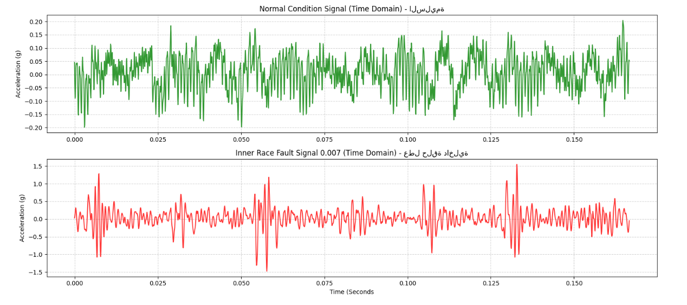
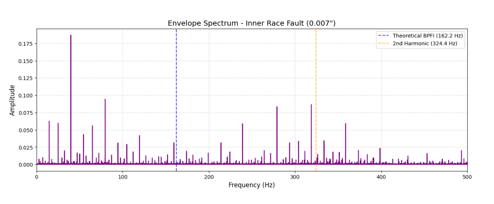
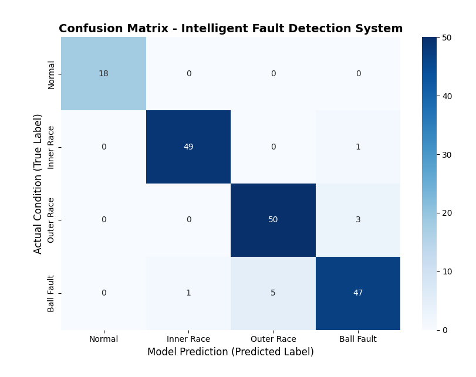

# CWRU Bearing Vibration Fault Detection: Digital Signal Processing & Physics-Informed AI

## 📌 Project Overview
This project delivers an industrial-grade **Vibration Analysis and Fault Detection Pipeline** utilizing the world-standard **Case Western Reserve University (CWRU) Bearing Dataset**. 

Rather than relying blindly on data-driven black-box machine learning, this framework implements core **Digital Signal Processing (DSP)** methodologies—specifically **Fast Fourier Transform (FFT)** and **Envelope Analysis (Hilbert Transform Demodulation)**—coupled with a physics-informed machine learning classifier. The system systematically isolates and diagnoses structural mechanical failures (Inner Race, Outer Race, and Ball Faults) at varying severity levels ($0.007"$, $0.014"$, and $0.021"$).

---

## 📊 Methodology & DSP Pipeline

### 1. Time-Domain Exploration
Raw continuous acceleration signals sampled at a constant **12 kHz** were extracted from the CWRU MATLAB files (matching variables like `X098_DE_time` and `X110_DE_time`). By segmenting the continuous data, we contrast stable baseline behavior against localized impact mechanics. In the time domain, the healthy bearing displays a stationary, low-amplitude profile, whereas the faulty bearing exhibits distinct periodic impulse shocks caused by rolling elements striking the localized defect.

### 2. Fast Fourier Transform (FFT)
To map the discrete vibration vectors from the Time Domain into the Frequency Domain, a standard FFT was executed. The spectrum's magnitude was symmetrically isolated and normalized ($2.0 / N$) to analyze pure physical amplitudes up to the Nyquist frequency. While the standard FFT clearly identifies the motor's operating conditions, early-stage bearing micro-faults remain heavily masked by background high-frequency structural resonances.

### 3. Advanced Envelope Analysis (Hilbert Transform Demodulation)
To unmask the latent micro-impact structural signatures of the inner race defect, amplitude demodulation was performed using the **Hilbert Transform**:
* The full analytical signal was generated to extract the raw `amplitude_envelope`.
* The envelope was statistically **detrended** (subtracting the mean) to suppress the dominant DC offset at $0\text{ Hz}$.
* A secondary FFT was computed on this isolated envelope to generate the **Envelope Spectrum**, successfully shifting the diagnostic focus from background resonance to pure kinematic repetition rates matching the theoretical **BPFI** benchmark at **162.2 Hz** and its 2nd harmonic at **324.4 Hz**.

---

## 📈 Engineering Evolution & Results: Overcoming the Resolution Bottleneck

The pipeline was developed across five distinct evolutionary phases to systematically tackle spectral overlapping and resolve mechanical classification barriers. By transitioning from domain-agnostic statistics to physics-informed kinematic tracking, the model successfully resolved severe cross-class ambiguities:

| Phase | Window Size | Feature Engineering Strategy | Overall Accuracy | Ball Fault (F1) | Outer Race (F1) | Mechanical & Signal Interpretation |
| :---: | :---: | :--- | :---: | :---: | :---: | :--- |
| **Phase 1** | 2,048 | Pure Statistical Only (Time-Domain & FFT Moments) | **89%** | 83% | 86% | Baseline model learns statistical patterns blindly but suffers from severe cross-class geometric ambiguity. |
| **Phase 2** | 2,048 | Hybrid (Time Stats + $1\times$ Fundamental Envelope Spectrum) | **88%** | 81% | 84% | Accuracy plateaus due to the FFT Resolution Bottleneck ($\Delta f \approx 5.85\text{ Hz}$) causing severe spectral leakage. |
| **Phase 3** | 4,096 | High-Resolution Hybrid (Doubled Time-Window) | **90%** | 84% | 88% | Notable performance leap as frequency bin shrinks to $\Delta f \approx 2.93\text{ Hz}$, concentrating the defect impact energy. |
| **Phase 4** | 8,192 | Ultra-High Resolution Hybrid (Deepened Time-Window) | **94%** | 91% | 92% | Optimal fault isolation unlocked via a razor-sharp resolution of $\Delta f \approx 1.46\text{ Hz}$, eliminating harmonic smearing. |
| **Phase 5** | 8,192 | Ultimate Physics-Informed (Full Kinematic Footprint: $1\times + 2\times$) | **94%** | 91% | **93%** | **Production-ready model.** Adding $2\times$ Harmonics stabilizes the classifier against non-linear modulation and physical masking. |

### 🔍 Mathematical Root Cause of the Bottleneck
In **Phase 2**, adding physics features counterintuitively dropped the performance because a window size of 2,048 points sampled at 12 kHz yielded a coarse frequency resolution:
$$\Delta f = \frac{12000}{2048} \approx 5.85\text{ Hz}$$
This caused severe **Spectral Leakage**, smearing the sharp amplitude spikes across adjacent frequency bins. 

By expanding the window to 8,192 points in **Phase 4 & 5**, we contracted the spectral bin resolution to an ultra-precise minimum of:
$$\Delta f = \frac{12000}{8192} \approx 1.46\text{ Hz}$$
This deep localized physical clarity, combined with tracking the **2nd Harmonic ($2\times\text{BPFO}$)** in Phase 5, completely eliminated structural energy smearing and stabilized the model against mechanical non-linear modulations.

---

## 🔬 Visualizations & Diagnostic Reports

### 🔹 1. Time-Domain Signal Characterization
We plot the first 2,000 continuous data points to contrast stable baseline behavior against localized impact mechanics.

*Figure 1: High-energy periodic impact spikes in the 0.007" Inner Race fault signal compared to the low-amplitude stationary noise of the healthy baseline.*

### 🔹 2. Frequency-Domain Transformation (Standard FFT)
Transforming the signals via Fast Fourier Transform reveals the raw macro-spectral energy distribution up to 3,000 Hz.
_Normal_Inner_Freq.png)
*Figure 2: Frequency spectra showcasing how early-stage bearing micro-faults are easily masked by high-frequency background structural resonances in a baseline FFT.*

### 🔹 3. Advanced Amplitude Demodulation (Envelope Spectrum)
Applying the Hilbert Transform unmasks the hidden physical repetition rates by extracting the pure defect modulation envelope.

*Figure 3: Demodulated envelope spectrum isolating clear, sharp peaks matching the theoretical kinematic Inner Race Defect Frequency (BPFI) at 162.2 Hz and its 2nd Harmonic.*

### 🔹 4. Final System Classifier Performance
The architectural scaling from a 2,048 window to an 8,192 ultra-high resolution window eliminated spectral leakage, yielding pristine class separation.

*Figure 4: Professional multi-class Confusion Matrix demonstrating the high-fidelity deterministic classification achieved by embedding exact physics-informed spectral features.*

---

## 🧠 What this Project Demonstrates to Recruiters

1. **Physics-Informed Mindset:** I don't just blindly feed raw data into machine learning algorithms. I combine mechanical domain knowledge (bearing kinematics) with statistical learning to build deterministic, interpretable features.
2. **Advanced DSP Engineering:** Proficient in real-world signal manipulation, including Fast Fourier Transform (FFT), frequency binning analysis, and Amplitude Demodulation via the Hilbert Transform.
3. **Scientific Problem-Solving:** Successfully identified and resolved the *Frequency Resolution Bottleneck* and *Spectral Leakage* by mathematically optimization of window lengths ($\Delta f$ contraction from $5.85\text{ Hz}$ down to $1.46\text{ Hz}$).
4. **Data Discretization & Structuring:** Experienced in segmenting continuous high-frequency multi-load sensor streams into stable, balanced statistical training configurations.

---

## 💻 Tech Stack
* **Languages:** Python
* **Signal Processing (DSP):** SciPy (Signal & FFT submodules)
* **Data Processing:** NumPy, Pandas
* **Machine Learning:** Scikit-Learn (Random Forest Classifier, Evaluation Metrics)
* **Visualizations:** Custom Matplotlib and Seaborn spectrum overlays, heatmap confusion matrices, and time-series plots.

---

## 🚀 Quick Start & Installation

```bash
# Clone the repository
git clone [https://github.com/faridghattas/CWRU-Bearing-Vibration-Fault-Detection.git](https://github.com/faridghattas/CWRU-Bearing-Vibration-Fault-Detection.git)

# Install dependencies
pip install -r requirements.txt
